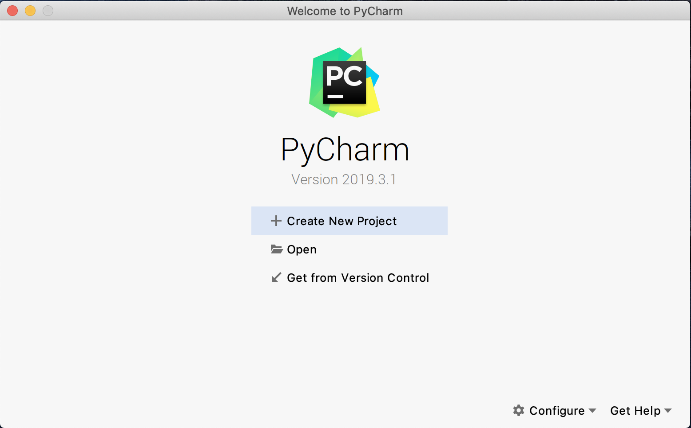
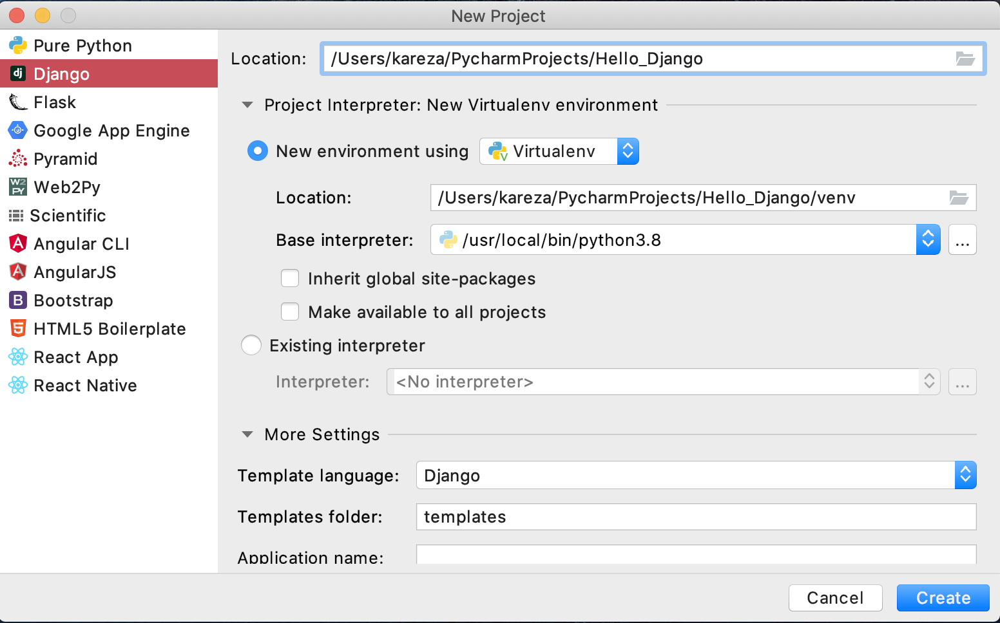
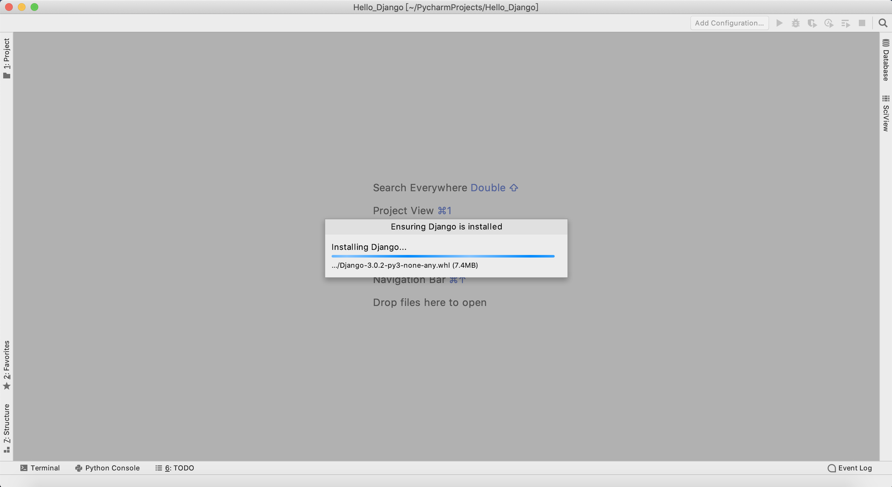
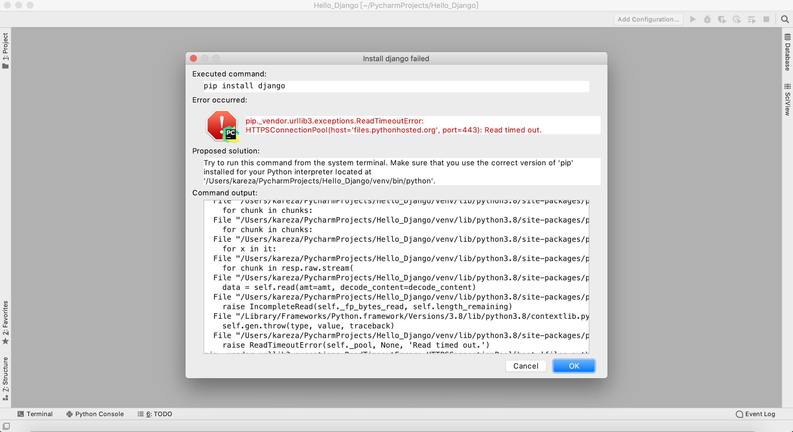
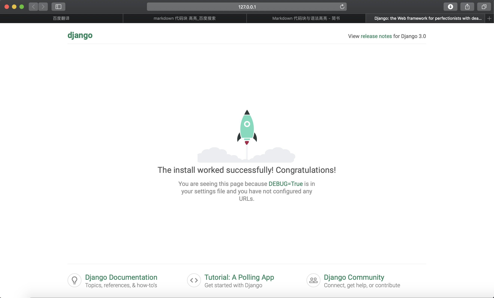

# Pycharm_Guide

*Author: kareza*

## How to create a Django project with Pycharm?



You can use the template provided by Pycharm to create Django.



Maybe you'll stop at this interface for a while.



Then an error is reported,because the download of  Django has timed out.



I suggest you use the second plan.

Close this window, open terminal, and start typing.

+ Install Django

  ```shell
  pip install -i https://pypi.doubanio.com/simple django
  ```

+ Start Project

  ```shell
  django-admin --version
  ```

  ```shell
  django-admin startproject hello_django .
  ```

  ```shell
  mkdir templates
  ```

+ Run Project

  ```shell
  python manage.py runserver
  ```

